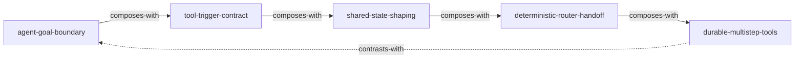

# AgentKit Documentation — Skill Index

> 本文档共蒸馏出 **5** 个原子 skills。
> 处理时间: 2026-05-16

## 关于这组材料

- **来源**: `docs/src/content/docs`
- **一句话主旨**: 用 agent、tool、state、router 和 Inngest step 把 AI 调用组织成可预测、可恢复的系统。
- **整体现解**: 见 `BOOK_OVERVIEW.md`

---

## Skill 列表

### Agent 定义

- `agent-goal-boundary` — 先定义单个 agent 该负责什么、不该负责什么，避免把 system prompt 膨胀成万能控制器。
- `tool-trigger-contract` — 用清晰的 `name`、`description` 和参数 schema 提高 tool 的触发稳定性。

### Network 编排

- `shared-state-shaping` — 把 workflow progress 写进结构化 state，而不是藏在自然语言 history 里。
- `deterministic-router-handoff` — 用显式 router 分支、done 条件和迭代上限控制 handoff 与终止。

### 耐久执行

- `durable-multistep-tools` — 把长链副作用工具拆成 Inngest step，获得自动重试、恢复与并发控制。

---

## 引用图

图例:
- `-->` depends-on
- `-.->` contrasts-with
- `===>` composes-with

---

## 推荐学习顺序

1. `agent-goal-boundary` — 先把单 agent 的职责与边界收紧。
2. `tool-trigger-contract` — 再把必须外置的能力写成模型能正确调用的 tool 契约。
3. `shared-state-shaping` — 然后把多 agent 协作所需的进度与产物写进 state。
4. `deterministic-router-handoff` — 再定义 handoff、终止和兜底逻辑。
5. `durable-multistep-tools` — 最后处理需要重试、恢复和并发控制的复杂工具链。

---

## 审计轨迹

- 候选单元池: `candidates/`
- 被淘汰的候选: `rejected/`
- 已验证单元: `verified.md`
- BOOK_OVERVIEW: `BOOK_OVERVIEW.md`